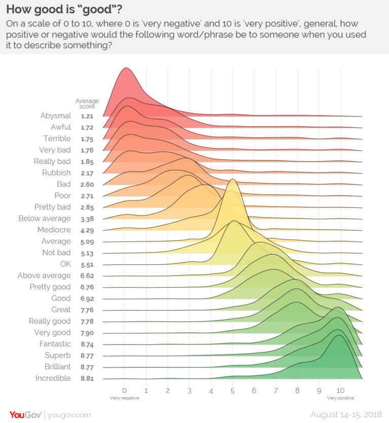

```{r setup, include=FALSE}
knitr::opts_chunk$set(echo = FALSE)
library("vembedr")
```

## Objectives

:::: {.column width=15%}
::::

:::: {.column width=70%}
- **Introduce the concept of data science**
- **Communicate the course learning outcomes**
- **Activity: Set up R Studio environments**
::::

:::: {.column width=15%}
::::

## Data Science

```{r data-science-life-cycle, echo=FALSE, fig.cap="The Data Science Life Cycle", fig.align='center', out.width = '50%'}
knitr::include_graphics("data-science-lifecycle.png")
```

## Data Scientist Skills

:::: {.column width=1%}
::::

:::: {.column width=29%}
```{r ds-skills-1, echo=FALSE, fig.cap="The Artist", fig.align='center', out.width = '100%'}

```
::::

:::: {.column width=29%}
```{r ds-skills-2, echo=FALSE, fig.cap="The Story Teller", fig.align='center', out.width = '100%'}
knitr::include_graphics("the-story-teller.png")
```
::::

:::: {.column width=29%}
```{r ds-skills-3, echo=FALSE, fig.cap="The Wizard", fig.align='center', out.width = '100%'}

```
::::

:::: {.column width=1%}
::::

## Example 1: Average Global Temperatures

:::: {.column width=1%}
::::

:::: {.column width=45%}
**Problem/Question Definition:** How have global temperatures changed over time?

**Dataset Source:** National Aeronautics and Space Administration (NASA)
  
**Objective:** Visualize data to show how global temperatures have changed over time.
::::

:::: {.column width=50%}
```{r climate-spiral-video, echo=FALSE}
embed_url("https://www.youtube.com/watch?v=LFGbWGMsuVY")
```
::::

:::: {.column width=1%}
::::

## Example 2: Measuring Good and Bad Words/phrase

:::: {.column width=1%}
::::

:::: {.column width=45%}
**Problem/Question Definition:** How positive or negative woudl the following word/phase be to someone when used?

**Dataset Source:** Survey from YouGov.com
  
**Objective:** Compare sentiments used when using a word/phrase.
::::

:::: {.column width=50%}
```{r good-and-bad-words, echo=FALSE, fig.cap="", fig.align='center', out.width = '100%'}

```
::::

:::: {.column width=1%}
::::

## Course Learning Outcomes

* Process structured and unstructured data, and produce informative data tables and visualizations, as well as able to understand and explain the basic structure of data, how it is collected, and evaluate its limitations.
* Apply statistical methods, techniques, approaches, and algorithms to extract necessary information and insights from data.
* Critique claims and evaluate decisions based on data, and write and run simple programming codes for data analysis and visualization.
* Apply data science concepts and methods to solve problems in real-world contexts and able to communicate results effectively.

## Activity: Set up R Studio environments

1. Create an account in [Posit Cloud](https://login.posit.cloud){target="_blank"}.

2. Try out your workspace and explore.
