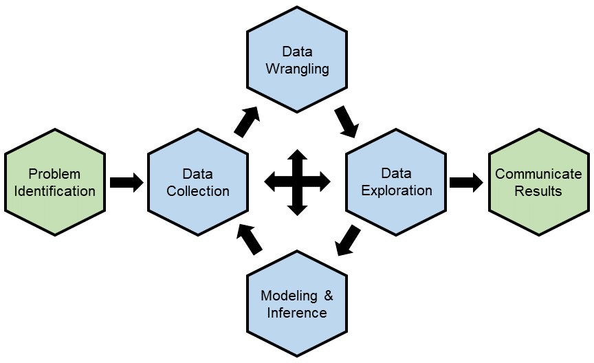
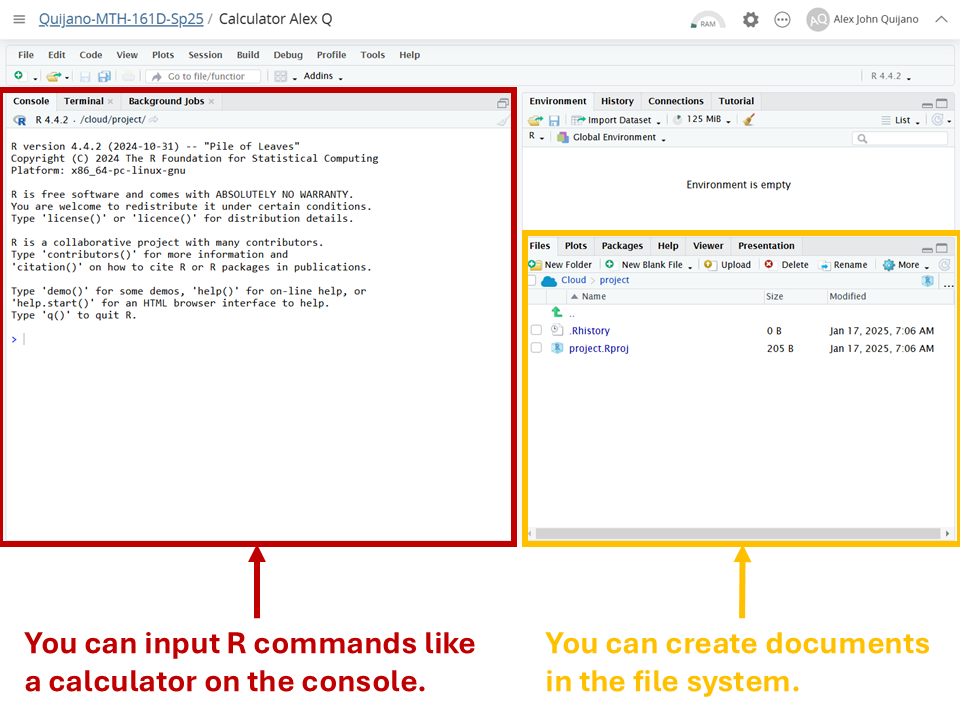
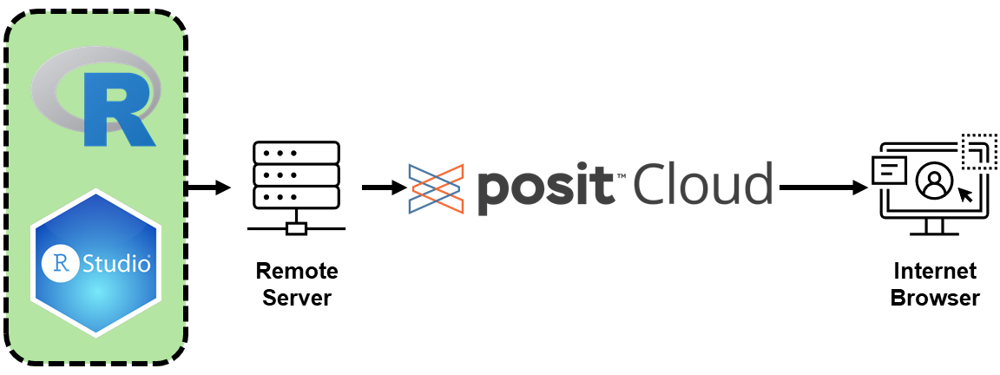
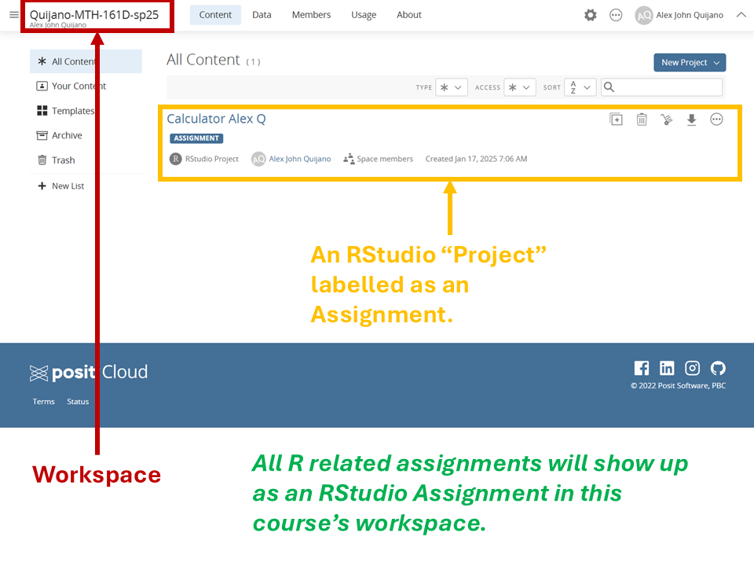
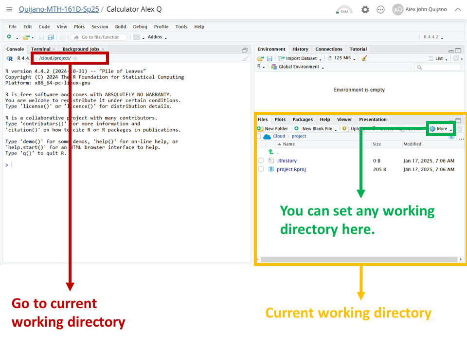
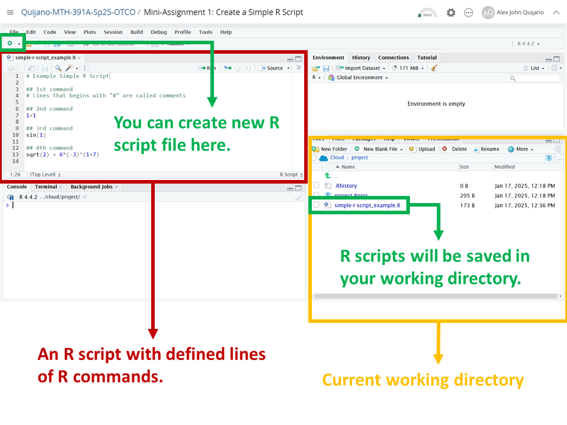
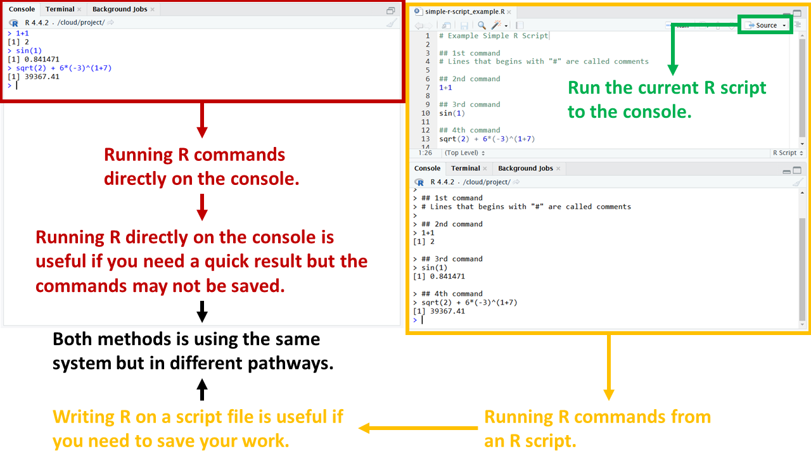

```{r setup, include=FALSE}
knitr::opts_chunk$set(echo = FALSE)
```

## Objectives

:::: {.column width=15%}
::::

:::: {.column width=70%}
- **Introduce R and R Studio**
- **Introduce the Posit Cloud**
- **Mini-Assignment: Create R Scripts**
::::

:::: {.column width=15%}
::::

## Previously...

The guiding principle of data science is the data science life cycle.

```{r data-science-life-cycle, echo=FALSE, fig.cap="The Data Science Life Cycle", fig.align='center', out.width = '50%'}

```

## R as a Tool for Statistics

### Why R?

:::: {.column width=1%}
::::

:::: {.column width=48%}
* **Open-source and Free:** Accessible to everyone.

* **Designed for Statistics:** Built with statistical analysis in mind.
::::

:::: {.column width=48%}
* **Extensive Libraries:** Thousands of packages available.

* **Data Visualization:** Easy and powerful plotting capabilities.

* **Active Community:** Help is just a forum post away.
::::

:::: {.column width=1%}
::::

## RStudio, a User-Friendly Interface

### What is R Studio?

:::: {.column width=1%}
::::

:::: {.column width=48%}
**Integrated Development Environment (IDE):** Built specifically for R.

**Cross-Platform:** Available on Windows, macOS, and Linux.
::::

:::: {.column width=48%}
**User-Friendly:** Simplifies coding, debugging, and visualizations.

**Enhanced Productivity:** Tools for managing projects, data, and outputs.
::::

:::: {.column width=1%}
::::

## Basic Parts of R Studio

```{r rstudio-1, echo=FALSE, fig.cap="Basic Parts of R Studio", fig.align='center', out.width = '50%'}

```

## Posit Cloud, a Cloud-Based Solution

:::: {.column width=1%}
::::

:::: {.column width=48%}
### What is Posit Cloud?
* **Cloud-Based Platform:** Accessible from any device with an internet connection.

* **Developed by Posit (formerly RStudio):** Tailored for statistics and data science.

* **No Installation Needed:** Run R and RStudio directly in your browser.
::::

:::: {.column width=48%}
### Why Use Posit Cloud?
* **Convenience:** No installation required; access RStudio instantly through the internet.

* **Consistency:** Same environment across devices.

* **Collaboration:** Share projects with students and instructors easily.

* **Cost-Effective:** Free tier available with premium options for advanced features.
::::

:::: {.column width=1%}
::::

## How Posit Cloud Works?

```{r posit-cloud-network, echo=FALSE, fig.cap="Posit Cloud Computing", fig.align='center', out.width = '75%'}

```

## Basic Parts of Posit Cloud

```{r posit-cloud-1, echo=FALSE, fig.cap="Basic Parts of Posit Cloud", fig.align='center', out.width = '50%'}

```

## R Studio Working Directory

```{r r-studio-2, echo=FALSE, fig.cap="The Working Directory", fig.align='center', out.width = '50%'}

```

## Creating an R Script

An R script is a file with an extension ".R". It can contain lines of R commands that you can define and run individual lines or run multiple lines.

```{r r-studio-3, echo=FALSE, fig.cap="R Script File Example", fig.align='center', out.width = '50%'}

```

## Running R on the Console vs Scripting

```{r r-studio-4, echo=FALSE, fig.cap="Running R Commands in Different Ways", fig.align='center', out.width = '50%'}

```

## Mini-Assignment: Create a Simple R Script

1. Go to this course's workspace in Posit Cloud and click the R Studio "Project" named *Mini-Assignment 1: Create a Simple R Script*. This will create a copy for you.

2. Try rerunning the R script named *simple-r-script_example.R*.

3. Create a new R script and save it as *my-simple-r-script.R*. In your script:
    - Write in your name as a comment.
    - Create 5 single line R commands with comments as labels similar to the example.
    
4. Export your R script file, then submit it in Moodle.
