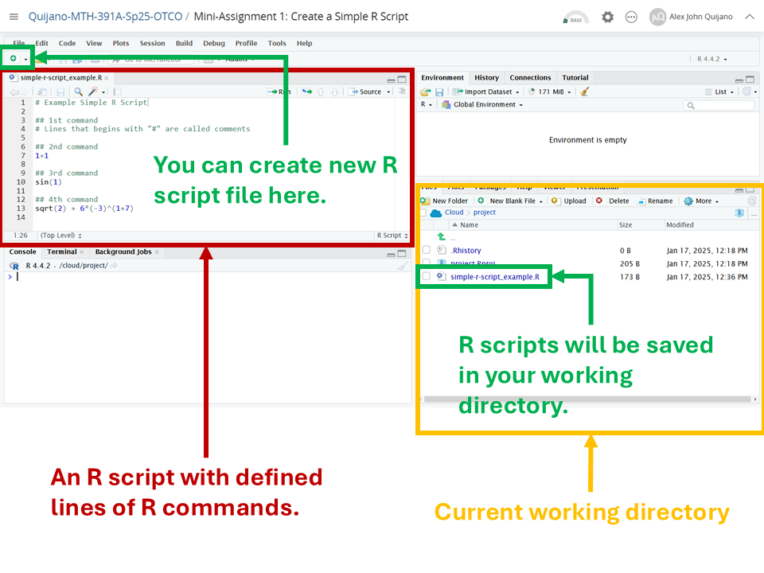
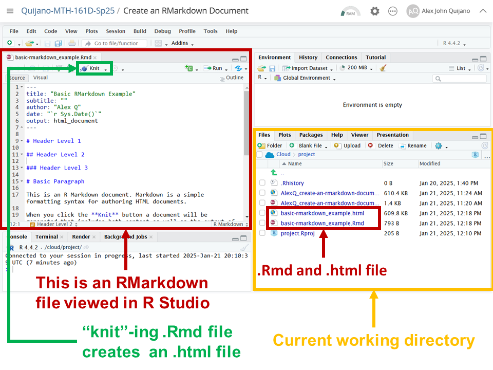
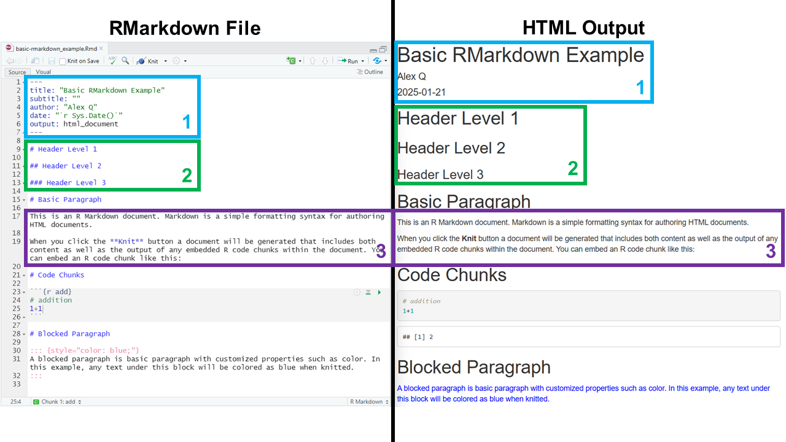
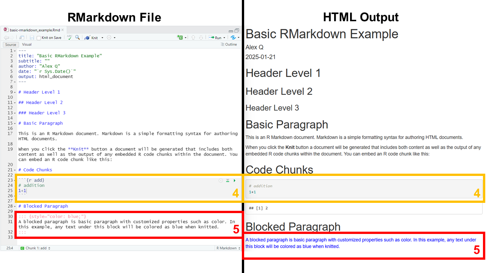
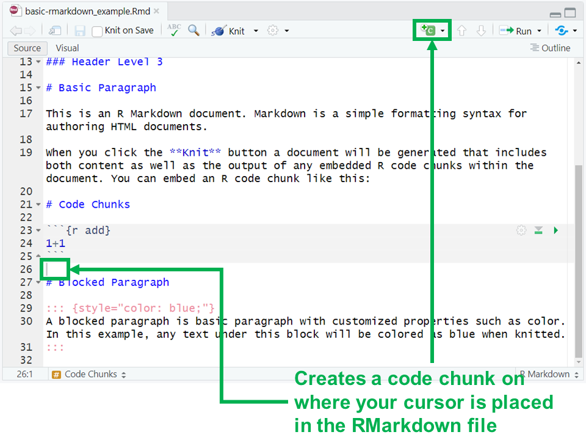
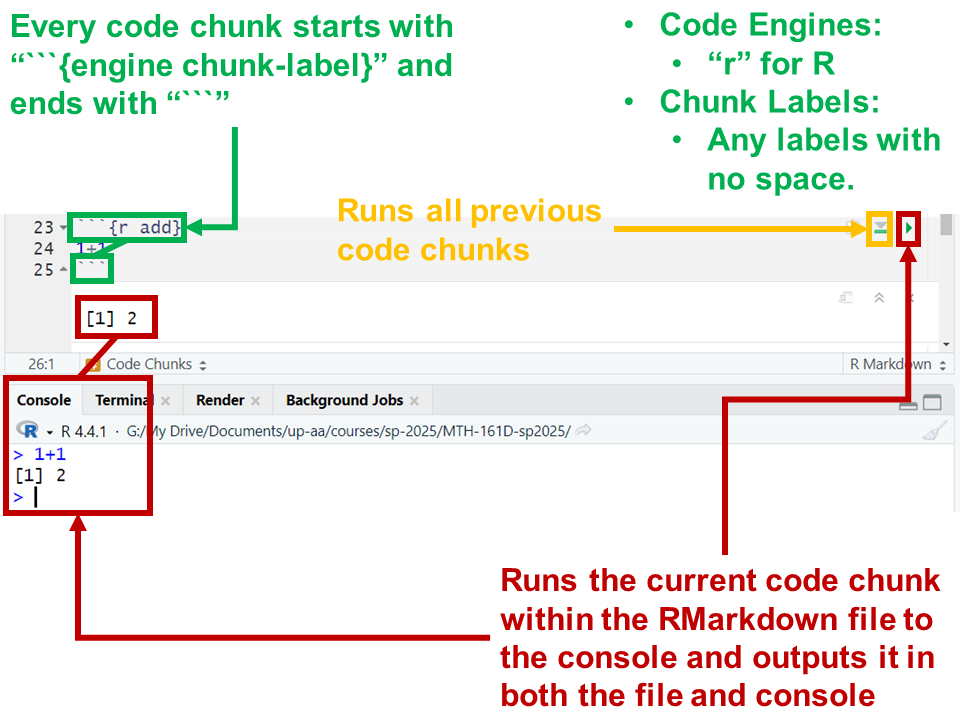

```{r setup, include=FALSE}
knitr::opts_chunk$set(echo = FALSE)
```

## Objectives

:::: {.column width=15%}
::::

:::: {.column width=70%}
- **Introduce R Markdown**
- **Elaborate motivations for learning R in Data Science**
- **Summarize expectations on assignment deliverables**
- **Activity: Modify an RMarkdown document**
::::

:::: {.column width=15%}
::::

## Previously... (1/2)

```{r r-studio-3, echo=FALSE, fig.cap="R Script File Example", fig.align='center', out.width = '50%'}

```

## Previously... (2/2)

```{r r-studio-4, echo=FALSE, fig.cap="Running R Commands in Different Ways", fig.align='center', out.width = '60%'}
knitr::include_graphics("r-studio-console-vs-scripting.png")
```

## RMarkdown, an Introduction

**What is RMarkdown?**

:::: {.column width=1%}
::::

:::: {.column width=48%}
* A tool for creating dynamic documents.
* Combines plain text, code, and outputs (e.g., plots, tables).
* RMarkdown is a file with extension ".Rmd", and when executed, it outputs into HTML, PDF, Word, or Slides.
::::

:::: {.column width=48%}
* It support multiple programming languages.
* It was created for the purpose of automating scientific reports and visualizations.
* It is also professional, clean, and organized.
::::

:::: {.column width=1%}
::::

## RMarkdown for Reproducibility

**Why use RMarkdown?**

:::: {.column width=1%}
::::

:::: {.column width=48%}
* **Dynamic and Flexible Document Creation:** Allows easy updates and ideal for iterative research processes.
* **Integration of Code and Results:** Combine R and other programming languages in the same document. Automatically executes and displays code outputs (e.g., tables, plots).
* **Python Equivalent:** Jupyter Notebook is similar to RMarkdown but it is primarily built for Python instead of R. *We will explore more on this later.*
::::

:::: {.column width=48%}
* **Widely Used in Data Science:** Popular in academia, industry, and reporting. Simplifies workflows for analysis, visualization, and documentation.
* **RMarkdown is required for this course's assignments:** All assignments must be completed in RMarkdown and submitted in both `.Rmd` and `.html` formats. *This ensures that your work is detailed, well-organized, and clearly presented.*
::::

:::: {.column width=1%}
::::

## RMarkdown in R Studio

**What does RMarkdown look like in R Studio?**

```{r rmarkdown-view, echo=FALSE, fig.cap="RMarkdown Viewed in R Studio", fig.align='center', out.width = '50%'}

```

## Basic Parts of RMarkdown (1/2)

:::: {.column width=60%}
```{r rmarkdown-basic-parts-1, echo=FALSE, fig.cap="RMarkdown Basic Parts 1, 2, & 3", fig.align='center', out.width = '100%'}

```
::::

:::: {.column width=39%}
1. **The YAML header:** It is placed at the very beginning of the file with start and end syntax "` --- `". This header is required and the information that it contains can affect the entire output.
2. **Levels of Headers:** It provides titles to sections.
3. **Basic Paragraph:** Normal text that you can write where a new line means new paragraph.
::::

## Basic Parts of RMarkdown (2/2)

:::: {.column width=60%}
```{r rmarkdown-basic-parts-2, echo=FALSE, fig.cap="RMarkdown Basic Parts 4 & 5", fig.align='center', out.width = '100%'}

```
::::

:::: {.column width=39%}
4. **Code Chunks:** The heart of RMarkdown, where you can run codes and present it and its output clearly with the rest of the document. The start and end syntax is "` ``` `".
5. **Blocked Paragraph:** A special paragraph that allows customization, such as changing the text color of its output.
::::

## Code Chunks in RMarkdown

:::: {.column width=49%}
```{r code-chunks-1, echo=FALSE, fig.cap="Creating an R Code Chunk", fig.align='center', out.width = '95%'}

```
::::

:::: {.column width=49%}
```{r code-chunks-2, echo=FALSE, fig.cap="Running Code Chunks", fig.align='center', out.width = '95%'}

```
::::

## Running R on RMarkdown vs Knitting

```{r running-r-code-chunks, echo=FALSE, fig.cap="", fig.align='center', out.width = '75%'}
knitr::include_graphics("running-rmarkdown-vs-knitting.png")
```

::: {style="color: red;"}
$\star$ Understanding this difference is key for fixing majority of errors and undesired outputs.
:::

## Transferable Skills

**Why learn any of these things?**

:::: {.column width=49%}
### Data Science

1. Informed decision making
2. Critical thinking
3. Understanding research
4. Critical assessment of reports in research and media
5. Problem-solving
::::

:::: {.column width=49%}
### R

1. Logical reasoning
2. Automating repetitive tasks
3. Programming is an in-demand skill in both industry and academia
4. Learning R is a gateway for more advanced programming languages
5. Learning how to code is a versatile skill and opens up opportunities
::::

## Expectations on Assignment Deliverables

### **Mini-Assignments**

In-class activities and mini-assignments must be submitted either physically or through Moodle. Depending on the lesson, submission format will be in physical form, `.pdf`, `.Rmd`, or `.html`.

### **Project Phases**

All project phase reports must be submitted in both `.Rmd` and `.html` files through Moodle.

::: {style="color: red;"}
$\star$ Mini-assignments and the Project will have special R Studio spaces.
:::

## Tips for Success

**How can I be successful in this class?**

:::: {.column width=49%}
### In-Class

* Show up to class
* Pay attention in class
* Be respectful to your peers
* Carefully read instructions and ask questions
* Know that it's okay to make mistakes
::::

:::: {.column width=49%}
### Assignments

* Participate in class activities
* Work on mini-assignments
* Work on your project diligently
* If there are significant errors, ask for help
* Be responsible for your own learning
::::

::: {style="color: red;"}
$\star$ Help hours --walk-in and by appointment-- exists!
:::

## Activity: Modify a RMarkdown document

The purpose of this activity is for you to get a sense of how mini-assignments and the project are done.

1. Log-in to Posit Cloud and open the R Studio assignment *Mini-Assignment 2: Modify a RMarkdown Document*.

2. Make sure you are in the current working directory. Rename the `.Rmd` file to your name. Then, open the `.Rmd` file.

3. Change the author in the YAML header.

4. Read the provided instructions. Then answer all problems.

5. Knit your `.Rmd` file to `.html` file. Then, export both of your `.Rmd` and `.html` files and submit them into Moodle.
