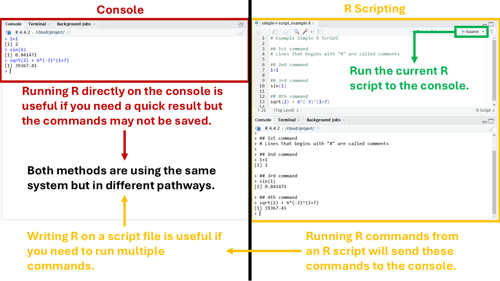

```{r setup, include=FALSE}
knitr::opts_chunk$set(echo = FALSE)
```

## Objectives

:::: {.column width=15%}
::::

:::: {.column width=70%}
- **Introduce R packages**
- **Introduce variables and functions**
- **Develop proficiency in working with one data frame**
- **Demonstration: Strategies on transforming a data frame**
- **Activity: Transform a data frame**
::::

:::: {.column width=15%}
::::

## Previously... (1/2)

```{r r-studio-4, echo=FALSE, fig.cap="Running R Commands in Different Ways", fig.align='center', out.width = '60%'}

```

## Previously... (2/2)

```{r running-r-code-chunks, echo=FALSE, fig.cap="", fig.align='center', out.width = '75%'}
knitr::include_graphics("running-rmarkdown-vs-knitting.png")
```

## R Packages

:::: {.column width=15%}
::::

:::: {.column width=70%}
**What are R packages?**

* Packages in R are collections of functions, data, and documentation that extend the capabilities of base R.
* It includes manuals and examples to help users understand how to use the package.
::::

:::: {.column width=15%}
::::

## Base R versus R Packages

| **Aspect** | **Base R** | **R Packages** |
|:---|:------|:------|
| *Availability* | Comes pre-installed with R | Must be installed and loaded |
| *Functionality* | Offers basic statistical and programming tools | Provides advanced or specialized tools not included in base R |
| *Customization* | Limited to what's already available | Highly customizable; users can install or even create their own packages |
| *Performance* | Base R can sometimes be slower or more verbose | Packages often include optimized or simpler syntax for complex tasks |
| *Speciality* | Limited only for basic statistics | Often built for a specific purpose or knowledge |

## The `tidyverse` Package

:::: {.column width=40%}
`tidyverse` is a collection of packages suited for data processing and visualization.

```{r tidyverse-hex, echo=FALSE, fig.cap="", fig.align='center', out.width = '60%'}
knitr::include_graphics("tidyverse.png")
```
::::

:::: {.column width=59%}
Core packages specifically for data processing:

:::: {.column width=20%}
```{r dplyr-hex, echo=FALSE, fig.cap="", fig.align='left', out.width = '100%'}
knitr::include_graphics("dplyr.png")
```

```{r tidyr-hex, echo=FALSE, fig.cap="", fig.align='left', out.width = '100%'}
knitr::include_graphics("tidyr.png")
```

```{r tibble-hex, echo=FALSE, fig.cap="", fig.align='left', out.width = '100%'}
knitr::include_graphics("tibble.png")
```
::::

:::: {.column width=78%}
* `dplyr` provides a grammar for data transformation.
* `tidyr` provides a set of functions that help you get data in consistent form.
* `tibble` is a data frame that prioritize simplicity, enforcing stricter checks to promote cleaner, more expressive code.
::::

::::

## Installing and Loading Packages


## Variables


## Functions


## Structure of a Data Frame


## Loading a Data Frame


## Viewing a Data Frame


## Data Frame Processing Workflow


## Verbs


## Row Operations


## Column Operations


## Combine and Customize


## Saving a Data Frame


## Demonstration

**What are some strategies on transforming a data frame?**


## Activity: Transform a data frame


