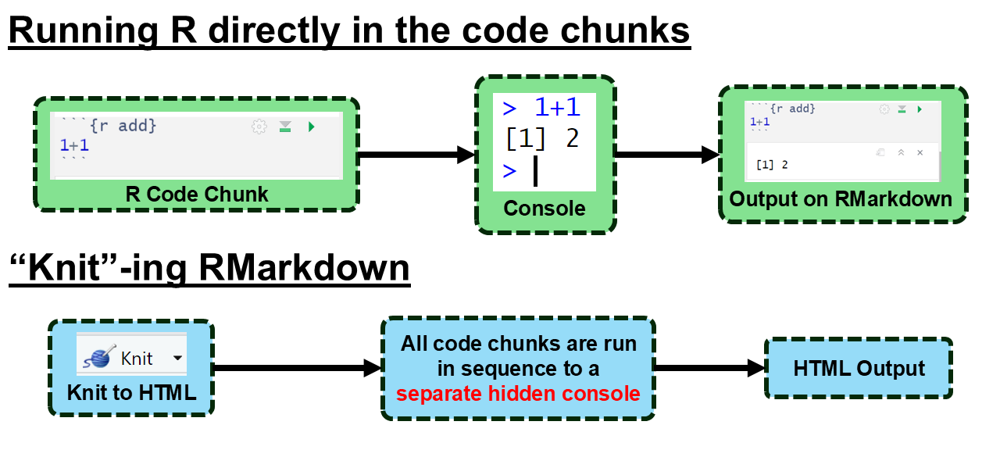
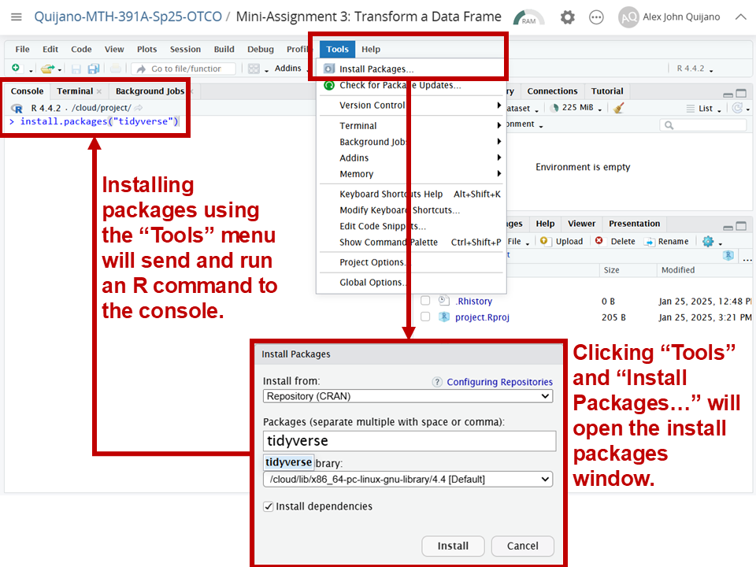
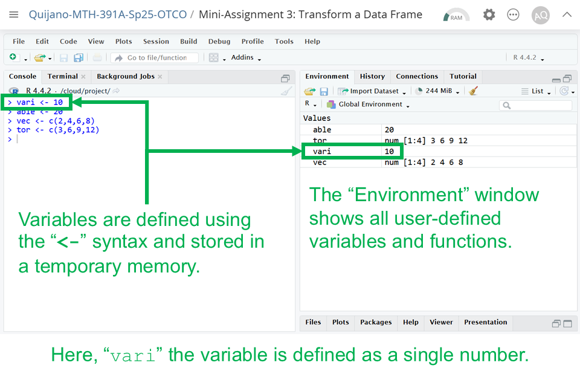
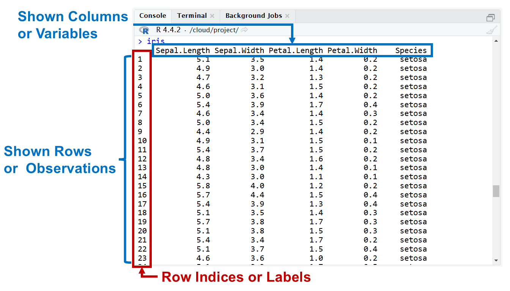

```{r setup, include=FALSE}
knitr::opts_chunk$set(echo = FALSE)
```

## Objectives

:::: {.column width=15%}
::::

:::: {.column width=70%}
- **Introduce R packages**
- **Introduce variables and data frames**
- **Develop proficiency in transforming one data frame**
- **Introduce a Strategy and best practice on transforming a data frame**
- **Activity: Transform a Data Frame**
::::

:::: {.column width=15%}
::::

## Previously... (1/2)

```{r r-studio-4, echo=FALSE, fig.cap="Running R Commands in Different Ways", fig.align='center', out.width = '60%'}
knitr::include_graphics("r-studio-console-vs-scripting.png")
```

## Previously... (2/2)

```{r running-r-code-chunks, echo=FALSE, fig.cap="", fig.align='center', out.width = '75%'}

```

## R Packages

:::: {.column width=15%}
::::

:::: {.column width=70%}
**What are R packages?**

* Packages in R are collections of functions, data, and documentation that extend the capabilities of base R.
* It includes manuals and examples to help users understand how to use the package.
::::

:::: {.column width=15%}
::::

## Base R versus R Packages {.smaller}

| **Aspect** | **Base R** | **R Packages** |
|:---|:------|:------|
| *Availability* | Comes pre-installed with R | Must be installed and loaded |
| *Functionality* | Offers basic statistical and programming tools | Provides advanced or specialized tools not included in base R |
| *Customization* | Limited to what's already available | Highly customizable; users can install or even create their own packages |
| *Performance* | Base R can sometimes be slower or more verbose | Packages often include optimized or simpler syntax for complex tasks |
| *Speciality* | Limited only for basic statistics | Often built for a specific purpose or knowledge |

## The `tidyverse` Package

:::: {.column width=40%}
`tidyverse` is a collection of packages suited for data processing and visualization.

```{r tidyverse-hex, echo=FALSE, fig.cap="", fig.align='center', out.width = '60%'}
knitr::include_graphics("tidyverse.png")
```
::::

:::: {.column width=59%}
Core packages specifically for data processing:

:::: {.column width=20%}
```{r dplyr-hex, echo=FALSE, fig.cap="", fig.align='left', out.width = '100%'}
knitr::include_graphics("dplyr.png")
```

```{r tidyr-hex, echo=FALSE, fig.cap="", fig.align='left', out.width = '100%'}
knitr::include_graphics("tidyr.png")
```

```{r tibble-hex, echo=FALSE, fig.cap="", fig.align='left', out.width = '100%'}
knitr::include_graphics("tibble.png")
```
::::

:::: {.column width=78%}
* `dplyr` provides a grammar for data transformation.
* `tidyr` provides a set of functions that help you get data in consistent form.
* `tibble` is a data frame that prioritize simplicity, enforcing stricter checks to promote cleaner, more expressive code.
::::

::::

## Installing Packages

**How to install R Packages?**

The following two methods installs the `tidyverse` package.

:::: {.column width=49%}
* **Using the "Tools" menu**

```{r tools-install, echo=FALSE, fig.cap="", fig.align='center', out.width = '80%'}

```
::::

:::: {.column width=50%}
* **Using the R Console Directly**

```{r tidyverse-install, message=FALSE, warning=FALSE, eval=FALSE, echo=TRUE}
install.packages("tidyverse")
```

::: {style="color: blue"}
$\dagger$ Try the above code sequence in your console. Then, install a different package called `plotly`.
:::

::: {style="color: red"}
$\star$ Knitting an RMarkdown with this function in a code chunk will probably give you an error or warning message. You need to run it directly on the console.
:::
::::

## Loading Packages

**How to load R Packages?**

The function `library()` loads any installed package. In this case `library("tidyverse")` loads the `tidyverse` package specifically.

```{r warning=FALSE, echo=TRUE}
library("tidyverse")
```

::: {style="color: blue"}
$\dagger$ Try the above code sequence in your console. Then, load the package `plotly`.
:::

## Variables

**How are variables created and stored in R?**

```{r variable-defined, echo=FALSE, fig.cap="", fig.align='center', out.width = '50%'}

```

::: {style="color: blue"}
$\dagger$ Create a variable named `ria` and initially define it as a number. Then, redefine `ria` as a vector. What happens to the original value of `ria` (the number) after it is redefined as a vector?
:::

::: {style="color: red"}
$\star$ Knowing and keeping track of what variables are defined is key to understanding why some errors occur.
:::

## Data Frame, An Introduction

:::: {.column width=15%}
::::

:::: {.column width=70%}
**What is a data frame?**

* A data frame is a key data structure in R used for storing data sets.
* It organizes data into rows and columns, similar to a spreadsheet.
* Each column can contain data of a different variable type (e.g., numeric, character, vector).
::::

:::: {.column width=15%}
::::

## Data Frame Key Characteristics

:::: {.column width=49%}
**Base R:** These data frames are data structures that comes with base R.

```{r r-base-df-view, echo=FALSE, fig.cap="", fig.align='center', out.width = '90%'}

```
::::

:::: {.column width=49%}
**Tibbles:** Tibbles are special kinds of data frames using the `tibble` package.

```{r tibble-df-view, echo=FALSE, fig.cap="", fig.align='center', out.width = '90%'}
knitr::include_graphics("data-frame-tibble.png")
```
::::

::: {style="color: red"}
$\star$ A base R data frame can be converted to a tibble data frame using the `tibble()` function. The `iris` data set is a built-in data in the `datasets` packages, which comes with base R.
:::

## Differences of R Data Frames and Tibbles {.smaller}

| **Feature** | **R Data Frames** | **Tibbles** |
|---:|:------|:------|
| *Printing* | Full display | Abbreviated, neat display |
| *Subsetting* | Returns vectors | Always returns tibbles |
| *String Handling* | Strings can become factors | Strings remain characters |
| *Column Names* | Allows partial matching | No partial matching, clearer errors |
| *Error Messages* | Less informative | More user-friendly |

## R Data Frames vs Tibbles, An Example

**Sub-setting Columns**

:::: {.column width=49%}
* R Data Frames returns a vector.
```{r echo=TRUE}
glimpse(iris[,"Sepal.Width"])
```
:::

:::: {.column width=49%}
* Tibbles returns tibbles.
```{r echo=TRUE}
glimpse(tibble(iris)[,"Sepal.Width"])
```
:::

::: {style="color: blue"}
$\dagger$ Try the above code examples using a different column on your console!
:::

::: {style="color: red"}
$\star$ Here, the `glimpse()` function is used to simplify the output of the subsets.
:::

## Data Frame Processing Using `dplyr`

:::: {.column width=49%}
**What is `dplyr`?**

* **Overview:**
    - `dplyr` is a powerful R package designed for data processing.
    - It is part of the `tidyverse` ecosystem.
    
* **Key Features:**
    - Simplifies common data wrangling tasks.
    - Intuitive syntax with chaining using the pipe operator `|>`.
::::

:::: {.column width=49%}
**Why use `dplyr`?**

* **Ease of Use:** Clear, human-readable code.
* **Efficiency:** Built-in functions optimized for performance.
* **Consistency:** Works seamlessly with other `tidyverse` packages such as `ggplot2` for visualizations.
* **Data Frames and Beyond:** Works with data frames, tibbles, and databases.
::::

## Core Verbs for Rows of `dplyr` {.smaller}

**`dplyr` functions that operates on rows.**

| **Verb** | **Purpose** & **Example** |
|:--|:--------|
| `filter()` | Chooses rows based on conditions <br><br>`filter(data, col1 > 10)` |
| `arrange()` | Reorders rows <br><br>`arrange(data, col1)` |
| `distinct()` | Finds all the unique rows <br><br>`distinct(data, col1)` |
| `count()` | Finds all unique rows, then counts the number of occurrences <br><br>`count(data, col1)` |

::: {style="color: red"}
$\star$ Notice that the data frame `data` in the examples are always in the first argument in the verbs. *The `filter()` verb uses logical operators, which we will discuss more in detail.*
:::

## Core Verbs for Columns of `dplyr` {.smaller}

**`dplyr` functions that operates on columns.**

| **Verb** | **Purpose** & **Example** |
|:--|:--------|
| `mutate()` | Adds or modifies columns <br><br>`mutate(data, new_col = col1-col2)` |
| `select()` | Chooses specific columns <br><br>`select(data, col1, col2)` |
| `rename()` | Renames specific columns <br><br>`rename(data, 1loc = col1)` |
| `relocate()` | Moves columns to the front <br><br>`relocate(data, col1)` |

::: {style="color: red"}
$\star$ The `=` signs in column verbs are not logical operators. Only the `filter()` verb uses the logical operators.
:::

## Chaining `dplyr` Verbs Using `|>`

:::: {.column width=15%}
::::

:::: {.column width=70%}
**What is `|>`?**

  * The pipe operator. 
  * It is used to chain multiple verbs in a logical sequence.
  * It starts with a data frame and ends with a transformed data frame.
::::

:::: {.column width=15%}
::::

## Example: Filter One Table Using `|>`

**Define Data Frame as a Tibble**

```{r echo=TRUE, eval=TRUE}
iris_tibble <- tibble(iris)
```

**Simple Example.** The following code sequence filters the `iris` data frame (in tibble form) to include only the "setosa" species.

```{r echo=TRUE, eval=FALSE}
iris_tibble |> 
  filter(Species == "setosa")
```

::: {style="color: red"}
$\star$ Notice that the first line is the data frame itself, then the next line is the verb without putting it directly into the first argument of the `filter()` verb. This is a common practice of organizing verbs in a pipeline.
:::

## Example: Transform One Table Using `|>`

**Advanced Example:** The goal of this example is to transform the `iris` dataset by computing the ratio of `Petal.Length` to `Sepal.Length` for observations belonging to the "setosa" species.

```{r echo=TRUE, eval=FALSE}
iris_tibble |> 
  # rule 1: choose only the "setosa" species
  filter(Species == "setosa") |> 
  # rule 2: pick the columns Sepal.Length and Petal.Length
  select(Sepal.Length,Petal.Length) |> 
  # rule 3: create a new column called length_ratio
  mutate(length_ratio = Petal.Length/Sepal.Length)
```

::: {style="color: blue"}
$\dagger$ Try the above code sequence in your console with the `virginica` species, and compute the ratio of `Petal.Width` to `Sepal.Width`.
:::

::: {style="color: red"}
$\star$ The verbs do not explicitly take the resulting data frames as the first argument because the pipe operator automatically passes the output of the previous step as the input to the next verb in the sequence.
:::

## Data Transformation Strategy and Best Practice

**What is a strategy and best practice on transforming a data frame?**

1. Understand your data frame, its variables, the variable types, and how many rows.
2. Know the end goal of transformation by visioning what it should look like.
3. Figure out what verbs are appropriate to use.
4. Vision a sequence of verbs that would lead you to the end goal.
5. Implement the verbs in code line-by-line, check the output, then make adjustments.

## In-Class Demonstration

**Case example:** Using the `iris` dataset, we want to determine the number of rows (or observations) for each species where the length ratio exceeds $0.80$ and the width ratio exceeds $0.50$. The length ratio is defined as `Petal.Length` divided by `Sepal.Length`, and the width ratio is defined as `Petal.Width` divided by `Sepal.Width`.

:::: {.column width=49%}
**The original number of rows pre-transformation**

```{r}
# counting sequence
iris_species_count <- iris_tibble |> 
  count(Species)
# display result
iris_species_count
```
::::

:::: {.column width=49%}
**Post-transformation results**

```{r}
# transformation sequence
iris_trans <- iris_tibble |> 
  # compute all ratios using lengths and widths
  mutate(ratio_length = Petal.Length/Sepal.Length,
         ratio_width = Petal.Width/Sepal.Width) |> 
  # select only the new variables and species variables
  select(Species,ratio_length,ratio_width) |>
  # apply the filter based on the given parameters
  filter(ratio_length > 0.80,
         ratio_width > 0.50) |> 
  # count the number of rows on what's left
  count(Species)
# display result
iris_trans
```
::::

::: {style="color: blue"}
$\dagger$ The goal of the demonstration is to replicate the shown data frames using the `dplyr` verbs.
:::

## Activity: Transform a Data Frame

The purpose of this activity is for you to start developing a proficiency in transforming a data frame using `dplyr` verbs.

1. Log-in to Posit Cloud and open the R Studio assignment *MA3: Transform a Data Frame*.
2. Make sure you are in the current working directory. Rename the `.Rmd` file by replacing `[name]` with your name using the format `[First name][Last initial]`. Then, open the `.Rmd` file.
3. Change the author in the YAML header.
4. Read the provided instructions.
5. Answer all exercise problems on the designated sections.
