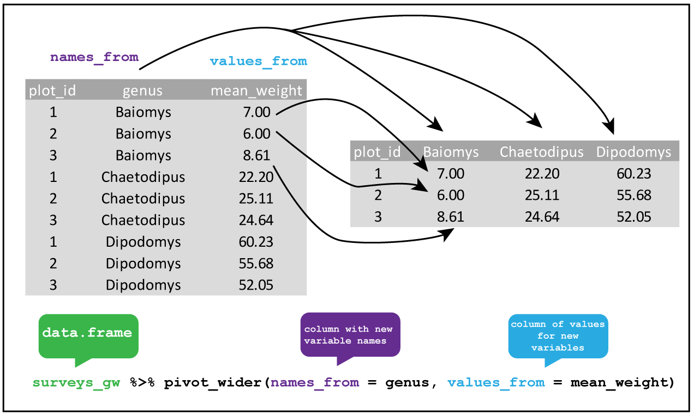

```{r setup, include=FALSE}
knitr::opts_chunk$set(echo = FALSE)
```

## Objectives

:::: {.column width=15%}
::::

:::: {.column width=70%}
- **Develop proficiency in reshaping data according to a categorical variable**
- **Introduce a Strategy and best practice on reshaping data frames**
- **Activity: Reshape Data by Category**
::::

:::: {.column width=15%}
::::

## Previously... (1/2)

**Chaining `dplyr` Verbs Using `|>`**

**Load Packages**

```{r eval=TRUE, echo=TRUE, message=FALSE, warning=FALSE}
library(tidyverse)
```

**Define Data Frame as a Tibble**

```{r echo=TRUE, eval=TRUE}
iris_tibble <- tibble(iris)
```

**Advanced Example:** The goal of this example is to transform the `iris` dataset by computing the ratio of `Petal.Length` to `Sepal.Length` for observations belonging to the "setosa" species.

```{r echo=TRUE, eval=FALSE}
iris_tibble |>  
  # rule 1: choose only the "setosa" species
  filter(Species == "setosa") |>  
  # rule 2: pick the columns Sepal.Length and Petal.Length
  select(Sepal.Length,Petal.Length) |>  
  # rule 3: create a new column called length_ratio
  mutate(length_ratio = Petal.Length/Sepal.Length)
```

## Previously... (2/2)

**Summarising by Piping Verbs**

The goal in this example is to compute the mean of the `Sepal.Length` column in each category of the `Species` column.

```{r echo=TRUE, eval=FALSE}
iris_tibble |> 
  # Step 1: group by species
  group_by(Species) |> 
  # Step 2: Calculate the mean of the Sepal.Length column
  #  - mean_sepal_length is the new column for the calculated mean
  summarise(mean_sepal_length = mean(Sepal.Length))
```

## Reshaping Data Frames

You can represent data in multiple ways, and reshaping data frames can be useful when working with datasets that are not in an easily accessible format. 

:::: {.column width=15%}
::::

:::: {.column width=70%}
Depending on your goals, restructuring the data can: 
  
  * Help simplify analysis
  * Improve clarity
::::

:::: {.column width=15%}
::::

## Example: Working with Unfamiliar Data Frame Structure

:::: {.column width=49%}
**The `Titanic` Data Set:** This data set comes with base R in the `datasets` package, which is not in a familiar R data frame format or `tibble` format.

```{r echo=TRUE, eval=TRUE}
glimpse(Titanic)
```
::::

:::: {.column width=50%}
**A 4-Dimensional Array:** The `Titanic` is a 4-dimensional array. To fix this, you can use the `as_tibble()` function to convert this 4-dimensional array into a data frame in tibble format.

```{r echo=TRUE, eval=TRUE}
titanic_tibble <- as_tibble(Titanic)
glimpse(titanic_tibble)
```
::::

::: {style="color: red"}
$\star$ Notice here that the `titanic_tibble` data frame appears to be a summary of the number of cases in each categorical variable.
:::

## Pivoting

:::: {.column width=49%}
**What is Pivoting?**

* Pivoting refers to reshaping data between wide and long formats. In tidyr, we use:
* `pivot_longer()`: Converts wide data into a long format.
* `pivot_wider()`: Converts long data into a wide format.
::::

:::: {.column width=50%}
**Why Pivot Data?**

* Long format is useful for visualization and modeling.
* Wide format is often easier to read and interpret.
* Data from different sources may need reshaping for compatibility.
::::

## Example: Use the `Class` as Columns in the `iris` Tibble

The goal is to create a table that Shows the `Class` categories as Columns.

:::: {.column width=49%}
**Original tibble**

```{r echo=TRUE,eval=TRUE}
glimpse(titanic_tibble)
```
:::

:::: {.column width=50%}
**Reshaped tibble**

```{r}
# using the subset create a new variable to save the reshaped data
titanic_wide_class <- titanic_tibble |> 
  # reshape the data frame as a table
  pivot_wider(
    names_from = "Class",
    values_from = "n"
  )
# show results
titanic_wide_class
```
::::

## Widening Data Frames

```{r pivot-wider, echo=FALSE, fig.cap="The function of `pivot_wider()`.", fig.align='center', out.width = '60%'}

```

*Figure is from [Alistair Bailey](https://ab604.github.io/docs/coding-together-2019/){target="_blank"} (University of Southampton).*

## Longing Data Frames

```{r pivot-longer, echo=FALSE, fig.cap="The function of `pivot_wider()`.", fig.align='center', out.width = '60%'}
knitr::include_graphics("pivot_longer_R_bailey.png")
```

*Figure is from [Alistair Bailey](https://ab604.github.io/docs/coding-together-2019/){target="_blank"} (University of Southampton).*

## In-Class Demonstrations

**Case example:** We want to convert the `titanic_wide_class` back into its original form.

:::: {.column width=49%}
**Reshaped tibble**
```{r echo=FALSE,eval=TRUE}
titanic_wide_class
```
::::

:::: {.column width=50%}
**Back to the original tibble**

```{r echo=FALSE,eval=TRUE}
# using the reshaped data, we reshape it back to its original form
titanic_back <- titanic_wide_class |> 
  pivot_longer(
    names_to = "Class",
    values_to = "n",
    -c("Sex","Age","Survived") # exclude other columns
  )
# show results
glimpse(titanic_back)
```
::::

::: {style="color: blue"}
$\dagger$ The goal of the demonstration is to use the `pivot_longer()` function to reshape it back to its original form.
:::

## Activity: Reshape Data by Category

The purpose of this activity is for you to start developing a proficiency in reshaping a data frame using the `pivot_longer()` and `pivot_wider()` verbs.

1. Log-in to Posit Cloud and open the R Studio assignment *MA5: Reshape Data by Category*.
2. Make sure you are in the current working directory. Rename the `.Rmd` file by replacing `[name]` with your name using the format `[First name][Last initial]`. Then, open the `.Rmd` file.
3. Change the author in the YAML header.
4. Read the provided instructions.
5. Answer all exercise problems on the designated sections.
