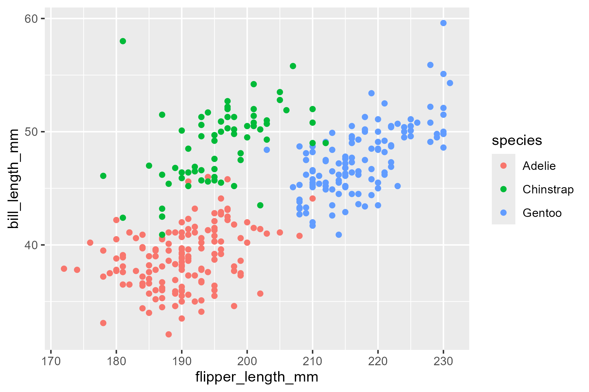
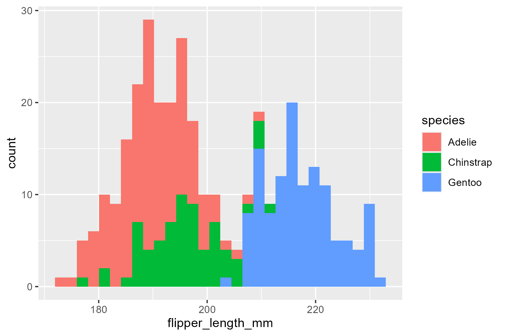

```{r setup, include=FALSE}
knitr::opts_chunk$set(echo = TRUE)
```

# Syllabus Reminders

* You must submit your worksheet individually by end-of-class or end-of-day. Your name must exist in your worksheet and the names of your collaborators.
* Worksheets are marked mostly on completion, and partially on correctness. It will be marked either pass or fail, there will no detailed feedback on worksheets, and no opportunities for revisions and make-up.

# Instructions

* For the exercises, please provide your answers in full sentences.
* Write your answers by replacing the text "[Write your answer here]".
* Please read the problems fully and carefully before answering.
* When finished, knit this `.Rmd` to `.html`.
* Submit this `.Rmd` and the recently knitted `.html`.

# Packages

The following R packages have already been loaded for you, so there's no need to load them yourself—they will be used in the problem sets. If you need any additional packages, you can load them here as well.

```{r message=FALSE, warning=FALSE}
# load packages
library(tidyverse)
library(palmerpenguins)
```

# Collaborators

::: {style="color: blue;"}
[Write your answer here]
:::

# Exercises

## Problem 1

Examine the `penguins` tibble. You may notice that there are `NA` values, which means missing data. Use the `drop_na()` function to remove all rows that has missing values on any column. Here, you may use chaining to pipe the tibble into `drop_na()`, and save the new tibble as a new R variable. How many rows was removed in the data set?

::: {style="color: blue;"}
[Write your answer here]
:::

## Problem 2

Replicate the following plot. Use the `NA` omitted `penguins` tibble you established in Problem 1. Use the `ggplot2` function `geom_point()`.

```{r penguins-flipper-vs-bill-length, echo=FALSE, fig.align='center', out.width = '70%'}

```

::: {style="color: blue;"}
[Write your answer here]
:::

## Problem 3

Use the `ggplot()` function `geom_histogram()` to replicate the following plot using the `NA` omitted `penguins` tibble you established in Problem 2. You may need to adjust the `bins` option in `geom_histogram()` to match the plot.

```{r penguins-flipper-length-distribution, echo=FALSE, fig.align='center', out.width = '70%'}

```

::: {style="color: blue;"}
[Write your answer here]
:::

## Problem 4

Create two plots similar to Problems 2 and 3, but instead of using the `species`, use the `sex` variable to group the numerical variables.

::: {style="color: blue;"}
[Write your answer here]
:::
