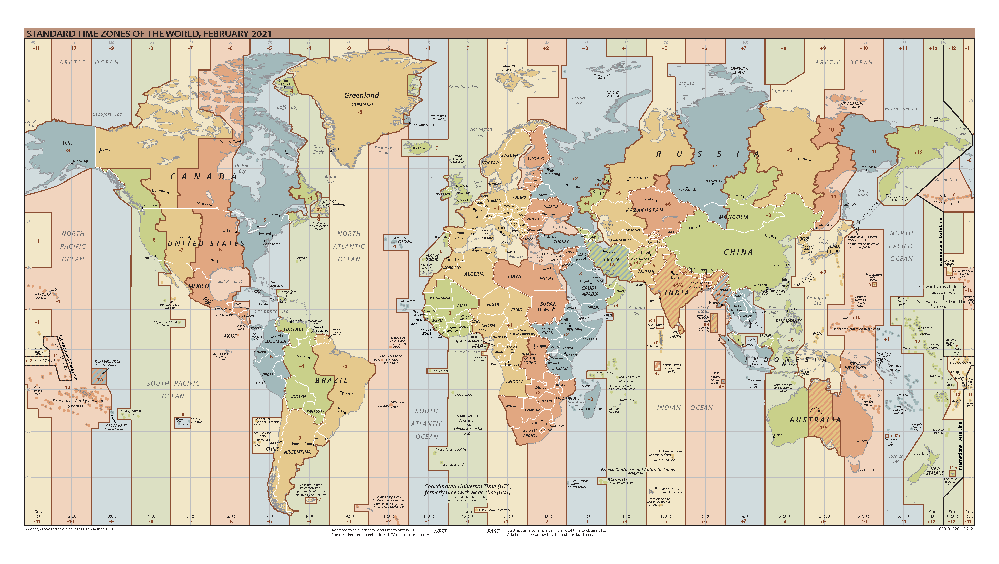

```{r setup, include=FALSE}
knitr::opts_chunk$set(echo = FALSE)
```

```{r message=FALSE, warning=FALSE}
library(tidyverse)
library(gridExtra)
set.seed(42)
```

## Objectives

:::: {.column width=15%}
::::

:::: {.column width=70%}
- **Develop an understanding how time is encoded**
- **Know how to work with date/time variables**
- **Activity: Working with Date/Time Variables**
::::

:::: {.column width=15%}
::::

## What is Temporal Data?

**Temporal data** refers to data that is associated with time, meaning it captures changes, trends, or patterns over a period.

**Key Characteristics:**

* *Time-Stamped:* Each data point is linked to a specific time (e.g., a date or timestamp).
* *Sequential Order:* The order of data points matters, as it reflects change over time.
* *Trends & Patterns:* Useful for analyzing progression, seasonality, or recurring behaviors.

## Case Study I

**New York City Flights**

* The `nycflights13` package: On-time data for all flights that departed NYC (i.e. JFK, LGA or EWR) in 2013
* The `nycflights23` package: Similar to `nycflights13` but in 2023

**Load Packages**

```{r echo=TRUE, message=FALSE, warning=FALSE}
library(nycflights13)
library(nycflights23)
```

**Data Frames**

```{r echo=TRUE, message=FALSE, warning=FALSE}
# bind the two data frames
flights <- nycflights13::flights %>% 
  rbind(nycflights23::flights)

# show size
dim(flights)
```

## Time as a Dimension/Variable

**Example Observations**

```{r echo=TRUE}
# take 3 random samples from each year
flights |> 
  select(flight, year, month, day, dep_time, arr_time) |> 
  group_by(year) |> 
  sample_n(3)
```

::: {style="color: red;"}
$\star$ **Key Idea:** Time variables are considered both ordinal categorical and discrete numerical, depending on how one views it on a dataframe.
::::

## Time Formats

:::: {.column width=50%}
To get the current date or date-time you can use `today()` or `now()`:

```{r echo=TRUE}
today()
now()
```

* The time format shown here is in [ISO8601](https://www.iso.org/iso-8601-date-and-time-format.html){target="_blank"}, an international standard for writing date/time.
::::

:::: {.column width=49%}
Four ways time variables can exist:

* While reading a file with `tidyverse`.
* From a string.
* From individual date-time components.
* From an existing date/time object.
::::

::: {style="color: red;"}
$\star$ **Key Idea:** Time formats can vary widely, so it's important to recognize different formats and convert them into a proper date/time format when needed.
::::

## Very Ambiguous Dates

:::: {.column width=49%}
**Example Dates**

```{r echo=TRUE}
dates <- "
  date,time
  03/11/25,09:55:00
  11/03/25,08:33:55
  03/25/11,20:22:13
"
```
::::

:::: {.column width=50%}
* In which format below are the given date/time written?

  - `Day / Month / Year`
  - `Day / Year / Month`
  - `Month / Day / Year`
  - `Month / Year / Day`
  - `Year / Day / Month`
  - `Year / Month / Day`

* What time format is it written?

  - 24-hour
  - 12-hour AM/PM
::::

::: {style="color: red;"}
$\star$ **Key Idea:** Sometimes dates in the data can be very ambiguous. Make sure to refer to the original source of the data and descriptions of the times variables.
::::

## Formating Date/Time

Using the `read_csv` function to load a `csv` file will automatically convert the dates into date/time data structure, but you need to specify the format.

**Reading a CSV and set the dates into `Month / Day / Year` format**

```{r echo=TRUE}
read_csv(dates, col_types = cols(date = col_date("%m/%d/%y")))
```

**Reading a CSV and set the dates into `Year / Month / Day` format**

```{r echo=TRUE, message=FALSE, warning=FALSE}
example_dates <- read_csv(dates,col_types=cols(date=col_date("%m/%d/%y")))
example_dates
```

::: {style="color: red;"}
$\star$ **Key Idea:** As long as the dates are valid, the formatting will work. For example, the date `03/25/11` with formatting `%y/%m/%d` will be invalid because there is no 25th month.
::::

## Processing Dates Written as Strings

R's date-time specification functions are powerful but requires careful attention to the date format.

:::: {.column width=49%}
**Example Dates**

```{r echo=TRUE}
# year-month-day
ymd("2017-01-31")

# month-day-year
mdy("January 31st, 2017")

# day-month-year
dmy("31-Jan-2017")
```
::::

:::: {.column width=50%}
**Converting String Dates into date/time format**

* Identify the order in which year, month, and day appear in your dates
* Arrange “y”, “m”, and “d” in the same order
* That gives you the name of the function that will parse your date
::::

## Time of Day

:::: {.column width=50%}
To create a date-time, append an underscore followed by one or more of "h," "m," or "s" to the parsing function's name.

```{r echo=TRUE}
ymd_hms("2025-03-11 20:11:59")
mdy_hm("03/11/2025 08:01")
```
::::

:::: {.column width=49%}
You can also convert a date into a date-time by specifying a timezone.

```{r echo=TRUE}
ymd("2025-03-11", tz = "US/Pacific")
```

Here I use the UTC timezone which you might also know as GMT, or Greenwich Mean Time, the time at 0° longitude. It doesn’t use daylight saving time, making it a bit easier to compute with .
::::

## Coordinated Universal Time (UTC)

```{r utc, echo=FALSE, fig.align='center', out.width = '100%'}

```

*Image Source: [CIA World FactBook - World Time](https://www.cia.gov/the-world-factbook/static/31913c20666d022fa1315bd444553f8d/world_time.pdf){target="_blank"}*

## Date/Time into Individual Components

```{r echo=TRUE}
example_dates |> 
  mutate(year=year(date), # year
         month=month(date), # month
         day=day(date), # day
         hour=hour(time), # hour (24-hr format)
         minute=minute(time), # minute
         second=second(time)) # second
```

## Filtering Date/Time Periods

**Convert date/time information into date/time format variable**

```{r echo=TRUE}
# create subset
flights_sub <- flights |> 
  mutate(date_time = make_datetime(year,month,day,hour,minute)) |> 
  select(flight,date_time)

# view random sample
flights_sub |> 
  sample_n(3)
```

**Use the `filter()`function in `tidyverse`**

```{r echo=TRUE}
# filter flights that occurred before 2013-03-11
flights_sub |> 
  filter(date_time < ymd("2013-03-11")) |>
  sample_n(3) # view random sample

# filter flights that occurred between May and August
flights_sub |> 
  filter(date_time >= ymd("2013-05-01") & date_time <= ymd("2013-08-01")) |>
  sample_n(3) # view random sample
```

## Time is Relative

* **Granularity Matters:** context defines time
    - seconds, minutes, hours, days, weeks, months, years, decades, etc.
    - semesters
    - seasons (winter, spring, summer, fall)
    - tv Show seasons or movie sequels
    - election cycles
* **Time Zones Shift Meaning:** Be mindful of time-zones
    - A "morning sale" in New York City, USA isn’t morning in Manila, Philippines
* **Sequential Time Isn't Always Linear:**
    - course progress (MTH 161,MTH 261,MTH361)

## Activity: Working with Date/Time Variables

1. Log-in to Posit Cloud and open the R Studio assignment *MA14: Working with Date/Time Variables*.
2. Make sure you are in the current working directory. Rename the `.Rmd` file by replacing `[name]` with your name using the format `[First name][Last initial]`. Then, open the `.Rmd` file.
3. Change the author in the YAML header.
4. Read the provided instructions.
5. Answer all exercise problems on the designated sections.
